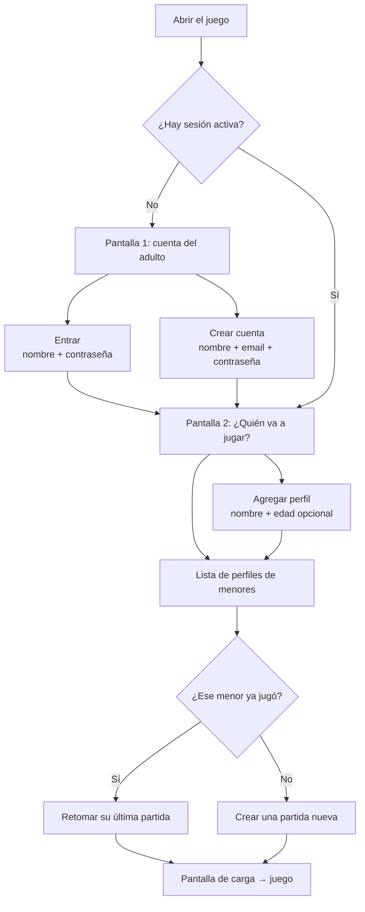

# Fishy! — Flujo de control parental

**Estado al 2026-08-14** · Rama `SupaBase`

Este documento explica el cambio de modelo de usuarios a **control parental**: qué
cambió, por qué, cómo queda el flujo de punta a punta y qué está verificado y qué no.

---

## 1. En una frase

Antes, el niño tenía su propia cuenta y su partida colgaba de ella. Ahora **la cuenta
es del adulto responsable**, y cada uno de sus hijos es un **perfil sin login** que
conserva su propio avance.

```
ANTES                          AHORA
Usuario ──► Partida            AdultoResponsable ──► UsuarioJugador ──► Partida
(login del niño)               (único con login)     (perfil del menor,
                                                      sin credenciales)
```

## 2. Por qué

- **Coherencia con el tema del juego.** Fishy! enseña seguridad infantil en línea. Un
  juego que le pide a un niño de 9 años crear una cuenta con contraseña contradice lo
  que enseña. Que el adulto administre los perfiles *es* el mensaje del juego.
- **Un adulto, varios hijos.** El caso real es una familia con dos o tres niños. Con
  el modelo viejo había que crear una cuenta por niño, con contraseñas que los papás
  terminan olvidando.
- **Los hermanos no comparten avance.** Decisión de producto del 2026-08-12: cada
  menor tiene sus propias partidas. Si compartieran, el progreso del hermano mayor
  arruinaría la experiencia del menor.

---

## 3. El flujo nuevo, paso a paso



### Paso 1 — Cuenta del adulto responsable

Es la **única cuenta con login**. Dos modos separados:

| Modo | Campos | Endpoint |
|---|---|---|
| **Entrar** | nombre + contraseña | `POST /api/auth/login/` |
| **Crear cuenta** | nombre + **email** + contraseña | `POST /api/auth/registro/` |

El **email es obligatorio y único** al registrarse. Opcionalmente se pueden mandar
apellido y edad.

> **Cambio de comportamiento a comunicar al equipo:** se eliminó el *"login
> inteligente"* que teníamos antes (intentaba entrar y, si fallaba, registraba solo).
> Ya no es posible: para registrar hace falta un email, y en el momento del login
> todavía no sabemos si vamos a registrar. Mantenerlo habría obligado a mostrar el
> campo email siempre, que es justo la fricción que ese atajo quería evitar. Ahora
> "Entrar" y "Crear cuenta" son dos modos explícitos.

### Paso 2 — Perfil de menor

Pantalla nueva: **"¿Quién va a jugar?"**. Lista los perfiles de esa cuenta y permite
crear uno nuevo (nombre + edad opcional). El nombre no se puede repetir dentro de la
misma cuenta.

### Paso 3 — Retomar o crear partida

Al tocar un perfil, el cliente pide `GET /api/jugadores/<id>/partidas/`:

- **Si trae partidas** → se retoma la primera (la de `fecha_update` más reciente).
- **Si viene vacío** → se crea una con `POST /api/partidas/`.

Esto es lo que hace que el avance de cada menor sea suyo y persista entre sesiones.
Sin este paso la pantalla de selección de perfil sería decorativa: solo se podrían
crear partidas nuevas, nunca recuperarlas.

---

## 4. Modelo de datos

```
AdultoResponsable   ← AUTH_USER_MODEL, la única cuenta con login
      │ 1─N
      ▼
UsuarioJugador      ← perfil del menor, SIN credenciales
      │ 1─N
      ▼
Partida ──► NPC ──► Chat ──► Mensaje
```

**Aislamiento:** todo lo que consulta el adulto se filtra por
`usuario_jugador__adulto=request.user`. Un adulto nunca ve datos de otro, ni puede
colgar una partida de un perfil ajeno. Está verificado con pruebas dedicadas (ver §7).

**Restricción:** `UniqueConstraint(adulto, nombre)` — no puedes tener dos hijos con el
mismo nombre en la misma cuenta.

---

## 5. Cambios de contrato de la API

Estos son los que **rompen** clientes viejos:

| Qué | Antes | Ahora |
|---|---|---|
| Respuesta de login/registro | `usuario_id` | **`adulto_id`** |
| Registro | nombre + password | nombre + **email** + password |
| Crear partida | `POST /partidas/ {progreso}` | requiere **`usuario_jugador_id`** |
| Campo dueño de la partida | `usuario` | **`usuario_jugador`** |

### Endpoints nuevos

| Método | URL | Para qué |
|---|---|---|
| GET | `/api/auth/perfil/` | Datos de la cuenta autenticada |
| GET / POST | `/api/jugadores/` | Listar / crear perfiles de menores |
| GET / PATCH / DELETE | `/api/jugadores/<id>/` | Detalle de un perfil |
| GET | `/api/jugadores/<id>/partidas/` | **Retomar el avance** de ese menor |

### Errores esperables

| Respuesta | Causa |
|---|---|
| `400` en registro | falta el email, o ya existe ese email/nombre |
| `400` al crear perfil | ya hay otro perfil con ese nombre en la cuenta |
| `404` al crear partida | falta `usuario_jugador_id`, o el perfil es de otro adulto |
| `401` en todo | falta `Authorization: Token ...` o el token no vale |

---

## 6. Qué se tocó en el cliente Unity

| Archivo | Cambio |
|---|---|
| `Assets/Scripts/ApiManager.cs` | `AdultoId` y `JugadorId` en el estado; `Registro()` con email; `CrearPartida()` manda `usuario_jugador_id`; DTOs nuevos; 7 métodos nuevos de perfiles; modo local ampliado |
| `Assets/Scripts/UI/AuthScreen.cs` | Reescrito: login y registro separados, campo email, panel "¿Quién va a jugar?" |
| `Assets/Scripts/ApiSmokeTest.cs` | Pasa por perfil de menor antes de crear partida |
| `Assets/Scripts/UI/README_Arranque.md` | Documentación del flujo de dos pasos |

**Método clave:** `ContinuarOCrearPartida(jugadorId, (partida, esNueva) => ...)` — encapsula
el paso 3 completo (pedir partidas → retomar la primera, o crear si no hay).

**Un bug silencioso que se corrigió:** el campo `usuario_id` renombrado a `adulto_id`
**no lanzaba error** en Unity. Newtonsoft simplemente dejaba el entero en `0` y el
juego seguía con un id inválido. Ese es el tipo de falla que no aparece en la consola
y se manifiesta después como un 404 incomprensible.

**Modo local (sin servidor):** también simula perfiles y partidas, ahora persistidos en
disco (PlayerPrefs). Antes las partidas locales vivían solo en memoria. Se cambió para
que **la demo sin conexión pueda mostrar lo esencial de la feature**: que cada hermano
retoma su propio avance. Si el backend no responde, el juego sigue siendo presentable.

---

## 7. Estado de verificación

Es importante separar lo que está probado de lo que no.

### ✅ Backend — verificado el 2026-08-14

`Backend/scripts/smoke_test.py` corrido contra Supabase: **46 OK, 0 fallas**. Cubre:

- Salud, y que sin token todo responda `401`.
- Registro / login / perfil del adulto, y que el registro sin email falle.
- Crear, listar, editar perfiles y rechazar nombres duplicados.
- Partidas por perfil, incluido rechazar perfiles ajenos.
- **Avance independiente por perfil** (que dos hermanos no se pisen).
- NPCs, chats, mensajes y banco de preguntas.
- **Aislamiento entre adultos**: 12 comprobaciones de que un adulto B recibe `404`
  en todo lo que pertenece al adulto A.

Además se replicaron a mano los payloads exactos que arma el cliente nuevo y se
confirmó que los nombres de campo de las respuestas calzan con los DTOs de Unity.

Sin drift de migraciones (`makemigrations --check` → *No changes detected*).

### ⚠️ Cliente Unity — SIN probar en el editor

El código está escrito, pero **no se ha abierto Unity**. Lo único verificado es la
sintaxis: los tres archivos pasaron por el compilador Roslyn que trae Unity sin
errores de sintaxis. No es una compilación completa — faltan los ensamblados de Unity
y Newtonsoft, que requieren abrir el proyecto.

**Falta:** abrir el editor, correr `ApiSmokeTest` contra el backend y jugar el flujo
de dos pasos a mano.

### Cabos sueltos conocidos

- **Pantalla de selección de perfil sin arte.** Se construye en runtime por código,
  igual que la de login. Funciona, pero es fea. Reemplazarla por una escena con arte
  no requiere tocar el `ApiManager`.
- **Copia huérfana de `ApiManager.cs`** en la raíz del repo (fuera de `Fishy!/`).
  Unity nunca la compila. Ahora está aún más desfasada. Falta decidir si se borra.
- **Tabla `Zona`** existe pero todavía no se relaciona con `NPC`/`Chat`. Queda para la
  HDU de riesgo por zona.
- **Riesgo por zona en el flujo Desconocidos** no acumula: los ids de nodo
  (`a0..a4`, `s0..s3`) no calzan con los `pregunta_id` del banco.

---

## 8. Cómo probarlo

### Backend

```powershell
cd Backend
# Cargar el .env al entorno (settings.py lee variables de entorno)
Get-Content .\.env | ForEach-Object {
  if ($_ -match '^\s*([^#][^=]*)=(.*)$') { Set-Item -Path ("env:" + $matches[1].Trim()) -Value $matches[2].Trim() }
}
.\.venv\Scripts\python .\backend\manage.py runserver
```

En otra terminal (con el `.env` cargado igual):

```powershell
.\.venv\Scripts\python .\scripts\smoke_test.py    # debe cerrar con 46 OK, 0 fallas
```

### Unity

1. En el componente `ApiManager`: `useLocalMode` **desactivado**,
   `baseUrl = http://127.0.0.1:8000/api`.
2. Abrir la escena `Boot` y darle Play.
3. Crear una cuenta (con email), agregar dos perfiles, jugar con uno.
4. **La prueba que importa:** volver a entrar, elegir el *otro* perfil y confirmar
   que arranca de cero; luego volver al primero y confirmar que retoma su avance.

> Para probar el modo sin conexión: apagar el backend. El badge de la esquina debe
> decir "Sin conexión (modo local)" y el flujo completo debe seguir funcionando.

---

## 9. Sobre la latencia

Supabase está en la nube: cada consulta paga ~65 ms y abrir la conexión ~500 ms más,
o sea **600–800 ms por request**. No es un error. El registro tarda ~1,3 s por el
hashing de la contraseña (Argon2). Es esperable que la pantalla de login se sienta
lenta; por eso muestra "Ingresando…" y bloquea el formulario.
